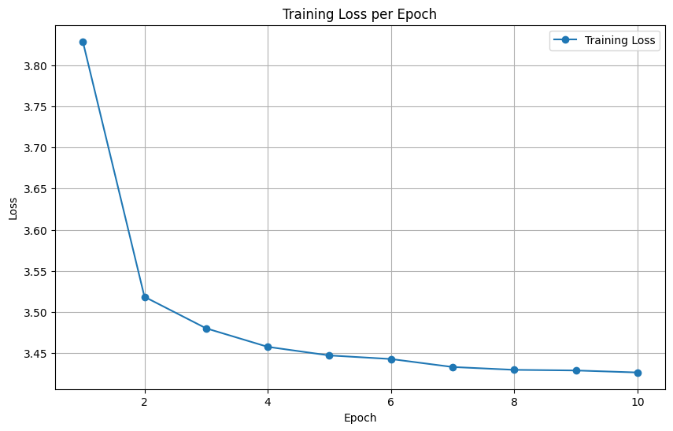
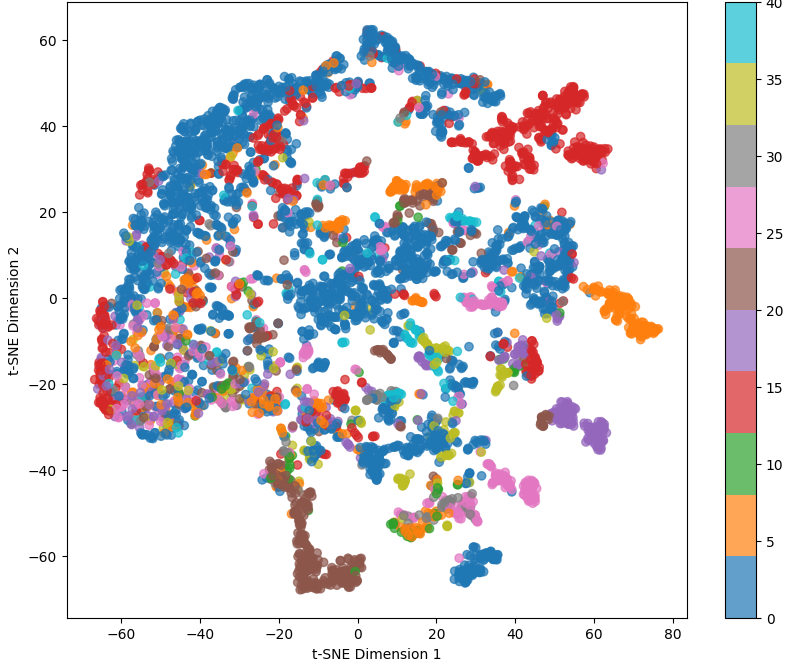
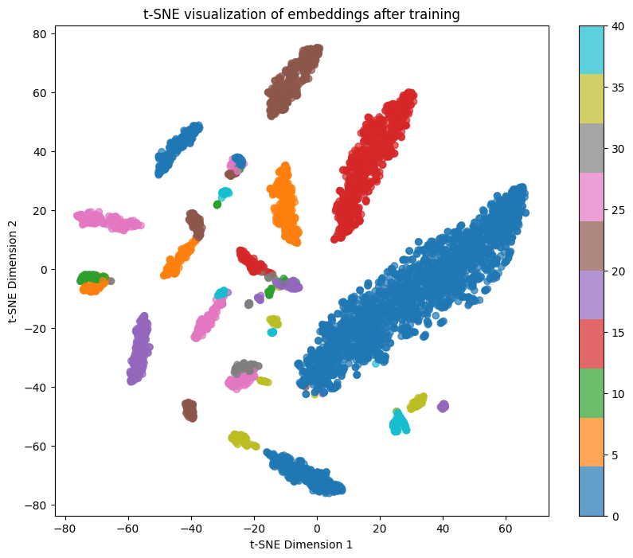
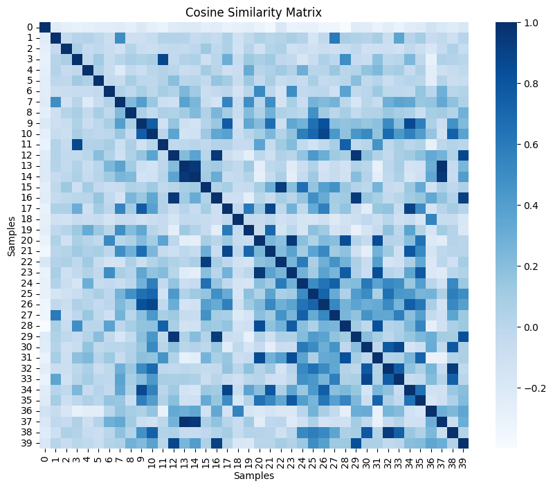
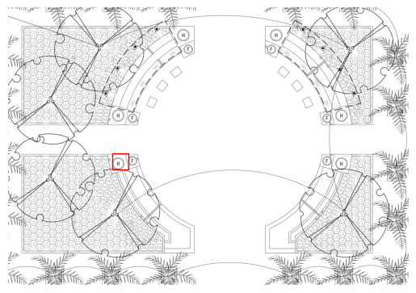

# SimCLR - Self-Supervised Learning for Visual Representation

This repository contains the implementation of SimCLR (Simple Contrastive Learning of Representations), a self-supervised learning approach for learning visual representations from unlabeled images.

## Table of Contents
1. [Introduction](#introduction)
2. [Installation](#installation)
3. [Implementation](#implementation)
5. [Results](#results)
5. [Conclusion](#conclusion)

## Introduction

SimCLR is a deep learning method for learning representations from unlabeled data using a contrastive learning approach. The model learns by maximizing agreement between positive pairs (similar images) and minimizing agreement between negative pairs (dissimilar images) in a latent space.

This implementation uses a ResNet-18 backbone, with a projection head applied on top of it, to extract feature embeddings. The objective is to achieve zero-shot learning or one-shot learning by seeking cosine similarity with output embeddings.

## Installation

Run the notebook. For dependency issues, initial code was run on cuda 12.08 and using python 3.10. 

## Implementation

The idea followed was to finetune the Firefighting symbol to SimCLR. SupConLoss is used because it achieves better sample efficiency in the situation where labels are shared by multiple patches.
In the order, 
- SymbolDataset is a builder class for the finetuning dataset
- Training loop for FT with Adam Optimizer and SupConLoss
- Optional: Plots to check learning and clustering
- New SymbolDetector: Finds new symbols by applying sliding windows

## Results

Finetuning on the firefighting symbols 

T-SNE clustering without finetuning. As expected, SimCLR pains to differentiate symbols at first.

After training:

Optional: Similarity matrix between the labels as seen by finetuned SimCLR

Detector performance on seen-once symbol H:

It only achieves detection of one symbol out of 4 on the image. Lowering confidence threshold brings background images to be detected. Increasing performance is possible but requires more thorough thinking of the detector and finetuning.

Further refining idea: 
- better detector
- better data augmentation for simCLR
- better preprocessing and post-processing